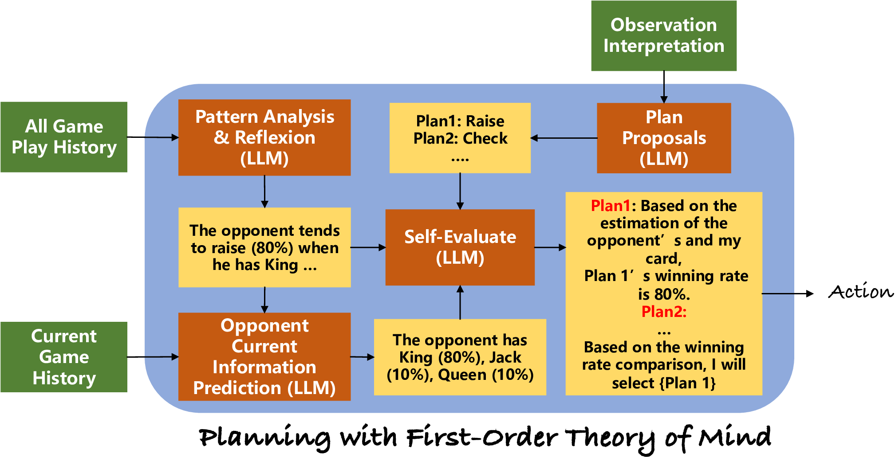
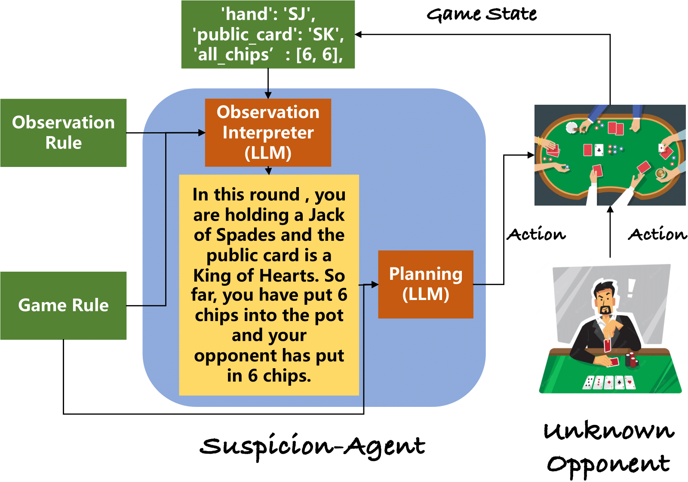
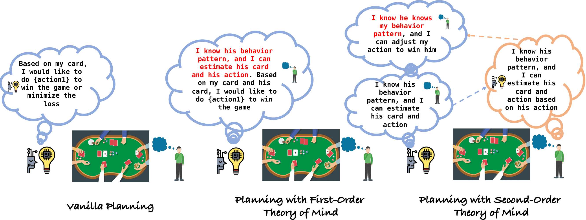
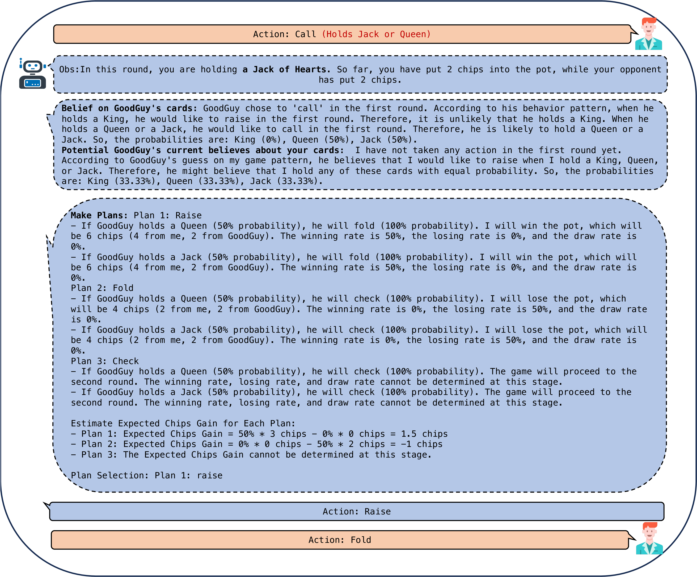
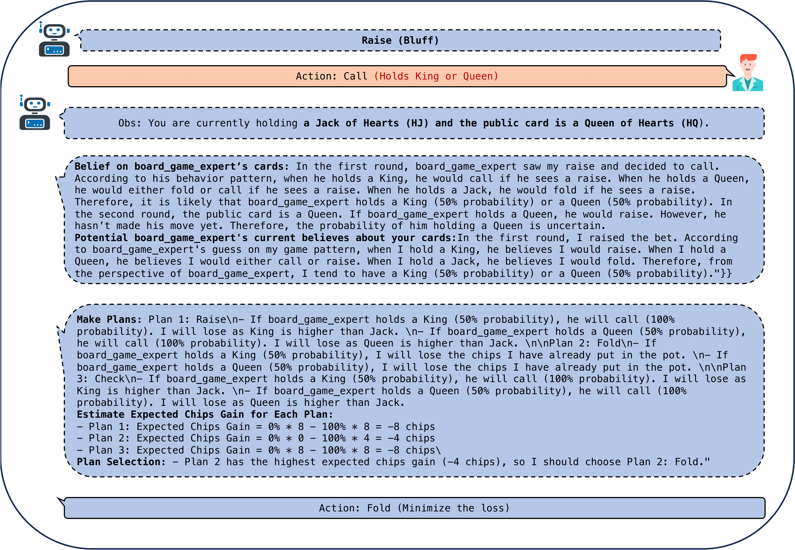

# Suspicion Agent: Playing Imperfect Information Games with Theory of Mind Aware GPT-4

The implementation of "[Suspicion Agent: Playing Imperfect Information Games with Theory of Mind Aware GPT-4](http://arxiv.org/abs/2309.17277)".

### [Project Demo](https://huggingface.co/spaces/cr7-gjx/Suspicion-Agent-Demo) | [Game Data Replay](https://huggingface.co/spaces/cr7-gjx/Suspicion-Agent-Data-Visualization) 


## Method







## Instruction

Install required packages with below command (python >= 3.8.5):

```
pip install -r requirements.txt
```

Set up the OpenAI key following [OPENAI_KEY](https://help.openai.com/en/articles/5112595-best-practices-for-api-key-safety)

Train and evaluate agents:

```
python main_vs_baseline.py --user --verbose_print  --rule_model [cfr/ nfsp / dqn / dmc]
```

## Sample Output




## Star History

[](https://star-history.com/#CR-Gjx/Suspicion-Agent&Date)


## Reference

```
@misc{guo2023suspicionagent,
      title={Suspicion-Agent: Playing Imperfect Information Games with Theory of Mind Aware GPT4}, 
      author={Jiaxian Guo and Bo Yang and Paul Yoo and Yuchen Lin and Yusuke Iwasawa and Yutaka Matsuo},
      year={2023},
      eprint={2309.17277},
      archivePrefix={arXiv},
      primaryClass={cs.AI}
}

```
Note: this code is based on the [SkyAGI](https://github.com/litanlitudan/skyagi). Many thanks to [the authors](https://github.com/litanlitudan/skyagi).
